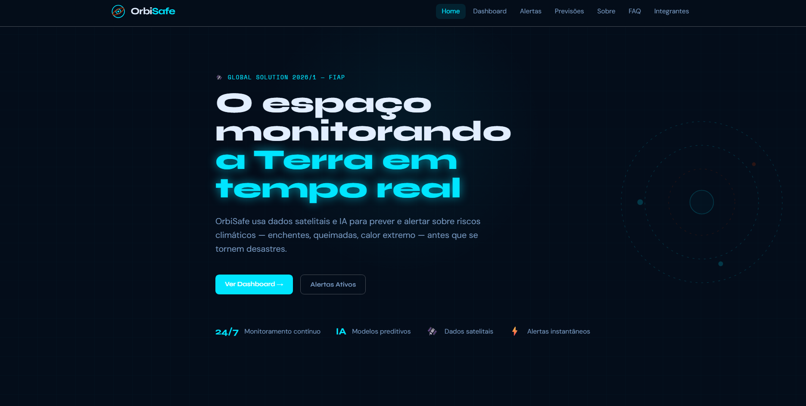
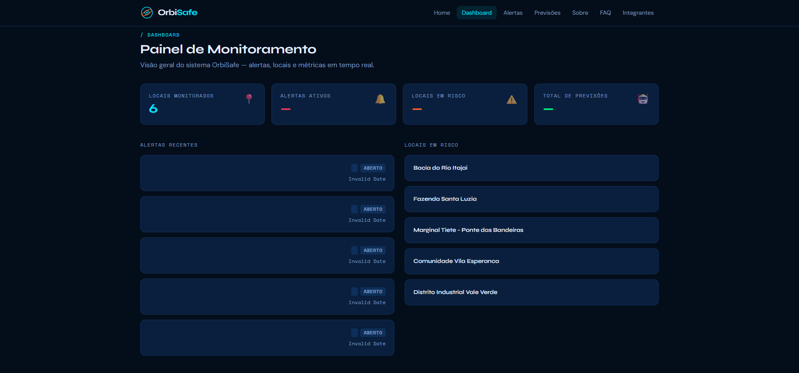
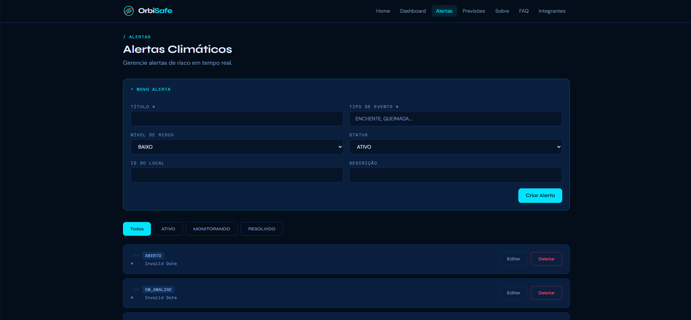

# 🌍 OrbiSafe - Monitoramento Inteligente de Riscos Climáticos


> **Global Solution 2026/1 - FIAP**
>
> **Monitorando a Terra a partir do espaço para antecipar riscos climáticos e proteger vidas.**

---

## Sobre o Projeto

O **OrbiSafe** é uma plataforma web desenvolvida para monitoramento e prevenção de eventos climáticos extremos. A solução utiliza dados espaciais, indicadores ambientais e Inteligência Artificial para identificar riscos de enchentes, queimadas e ondas de calor extremo antes que eles se transformem em desastres.

O objetivo é fornecer informações claras, acessíveis e em tempo real para cidadãos, órgãos públicos e equipes de emergência, auxiliando na tomada de decisões e na mitigação dos impactos causados por eventos climáticos.

O projeto foi desenvolvido durante a **Global Solution FIAP 2026**, integrando conhecimentos de Front-End, Back-End, Banco de Dados, Engenharia de Software e Business Model.

---

## Tecnologias Utilizadas

### Front-End

* React
* Vite
* TypeScript
* Tailwind CSS
* React Router DOM
* Fetch API

### Back-End

* Java
* Quarkus
* REST API

### Banco de Dados

* Oracle Database

### Deploy e Versionamento

* Git
* GitHub
* Vercel

---

## Principais Funcionalidades

*  Monitoramento de enchentes
*  Detecção de áreas suscetíveis a queimadas
*  Identificação de ondas de calor extremo
*  Sistema de alertas preventivos
*  Dashboard com indicadores climáticos
*  Visualização de áreas de risco
*  Integração com API REST
*  Interface responsiva para desktop, tablet e smartphone
*  Central de dúvidas (FAQ)
*  Página de integrantes
*  Página institucional da solução

---

## Diferenciais da Solução

* Utilização de dados espaciais para análise ambiental.
* Interface moderna e intuitiva.
* Navegação SPA (Single Page Application).
* Integração entre Front-End, API Java e Banco Oracle.
* Arquitetura escalável baseada em componentes reutilizáveis.
* Responsividade para múltiplos dispositivos.

---

## Preview da Aplicação

### Home



### Dashboard



### Alertas



> Substitua as imagens acima pelos prints reais da aplicação antes da entrega.

---

## Arquitetura do Projeto

```text
Usuário
   │
   ▼
React + Vite + TypeScript
   │
   ▼
API REST (Java + Quarkus)
   │
   ▼
Oracle Database
```
---

## 📂 Estrutura de Pastas

```text
orbisafe/
├── public/
├── src/
│   ├── assets/
│   ├── components/
│   │   ├── layout/
│   │   │   ├── Navbar.tsx
│   │   │   └── Footer.tsx
│   │   └── ui/
│   │       └── index.tsx
│   │
│   ├── hooks/
│   │   └── useFetch.ts
│   │
│   ├── pages/
│   │   ├── Home.tsx
│   │   ├── Dashboard.tsx
│   │   ├── Alertas.tsx
│   │   ├── Previsoes.tsx
│   │   ├── FAQ.tsx
│   │   ├── Sobre.tsx
│   │   └── Integrantes.tsx
│   │
│   ├── services/
│   │   └── api.ts
│   │
│   ├── types/
│   │   └── index.ts
│   │
│   ├── App.tsx
│   └── main.tsx
│
├── tailwind.config.js
├── package.json
└── README.md
```
---

## Links do Projeto

### Deploy

https://orbisafe.vercel.app

### Repositório GitHub

https://github.com/ArthurLinsBelarmino/orbisafe

### Vídeo Demonstrativo

Em breve

---

## Como Executar o Projeto Localmente

Clone o repositório:

```bash
git clone https://github.com/ArthurLinsBelarmino/orbisafe.git
```
Acesse a pasta:

```bash
cd orbisafe
```
Instale as dependências:

```bash
npm install
```
Execute o projeto:

```bash
npm run dev
```
A aplicação estará disponível em:

```bash
http://localhost:5173
```
---

## Integração com API

O sistema realiza comunicação com uma API REST desenvolvida em Java, permitindo:

* Consulta de alertas climáticos;
* Consulta de previsões;
* Operações CRUD;
* Consumo de dados em tempo real;
* Tratamento de respostas e erros;
* Integração com Banco Oracle.

---

## Equipe de Desenvolvimento

| Integrante                                | RM       | Turma           | Função               |
| ----------------------------------------- | -------- | --------------- | -------------------- |
| Arthur Lins Belarmino                     | RM566845 |      1TDSPS     | Front-End & Business |
| Henrique Spoltore Moreno Pavão dos Santos | RM568130 |      1TDSPS     | Front-End & Business |
| Raphael Mendonça                          | RM568346 |      1TDSPS     | Front-End & Business |

### Arthur Lins Belarmino

* GitHub: https://github.com/ArthurLinsBelarmino
* LinkedIn: https://www.linkedin.com/in/arthur-lins-belarmino-3b1369328/

### Henrique Spoltore Moreno Pavão dos Santos

* GitHub: https://github.com/henrique477
* LinkedIn: https://www.linkedin.com/in/henrique-pav%C3%A3o-849407251

### Raphael Mendonça

* GitHub: https://github.com/Raphael-Sinelli
* LinkedIn: https://www.linkedin.com/in/raphael-sinelli-675310321

---

## Projeto Acadêmico

Projeto desenvolvido para a **Global Solution 2026/1 da FIAP**, com foco na utilização de tecnologias espaciais e Inteligência Artificial para monitoramento ambiental, prevenção de desastres naturais e apoio à tomada de decisões.

---

## Licença

Projeto desenvolvido exclusivamente para fins acadêmicos.

© 2026 — Equipe OrbiSafe.
